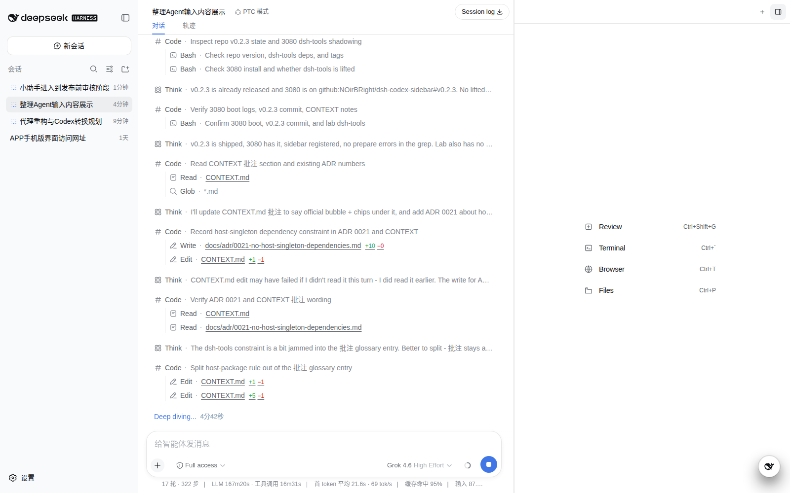
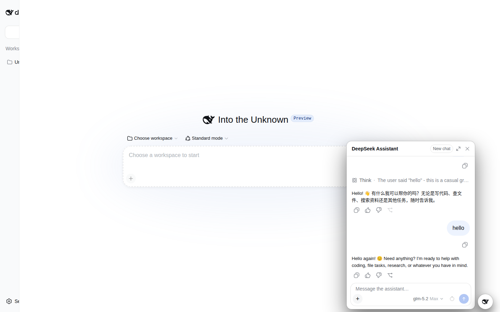
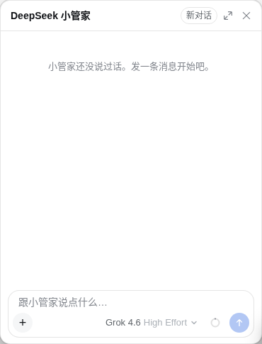

# DeepSeek 小管家

Harness 里已经有二十几个桌宠。它们做的是皮：跟着当前会话眨眼、忙碌、失败。

这个不是。

**小管家是一个真正的 Agent。** 它有自己的会话、自己的历史、自己的提醒，不属于任何一个项目。右下角那只鲸鱼只是它坐的位子。



中间那条会话是你当前任务的手：写文件、跑命令、开终端。角落这只是跨任务的脑子——换项目、换会话，它还在；也不会出现在左边的会话列表里。



## 你怎么用它

点鲸鱼。直接说话。

「我这条任务现在在干什么？」——它自己去读当前页面的任务，不用你先点「引用任务」。打招呼、闲聊、问常识，它不会翻你的项目。

「二十分钟后提醒我看 CI。」——到点会在席位里叫你。浏览器没开也没关系，Harness 进程得在跑。

上下文快满了，点标题栏的「新对话」。它会带一份很短的交接开下一条，旧的归档留下，不会把整本聊天复制过去。



输入栏没有权限下拉。它本来就不能改你的仓库。

## 它能做什么，不能做什么

能：网上搜、只读看文件、记待办和目标、设提醒、看你贴的图。

不能：bash、写文件、改代码、外派 Codex / Claude / Cursor、去开你的 Browser。

这版也还不会「替你往另一条会话里塞一句」或「去某个项目开新任务」。那是下一截。

## 安装

DeepSeek Harness Web，`0.1.0-rc.7` 或更新。

```bash
dsh plugin --profile web add github:NOirBRight/dsh-llm-assistant#v0.1.5
```

装完重启 Web。提醒由插件插入官方 schedule。任务引用走官方 `session-reference`：rc.8+ 由 web-app 提供，rc.7 在缺失时由插件补上。

## 开发

```bash
pnpm run check
pnpm run build
```

实验只走 `DSH_HOME=~/.dsh-lab` 的 3082。不要把 Workstation 路径写进 `~/.dsh`。

从正在跑的 Web 复拍界面（默认 3080）：

```bash
CHROME_PROFILE=~/.local/share/dsh-launchers/chrome-web node scripts/capture-readme.mjs
```
